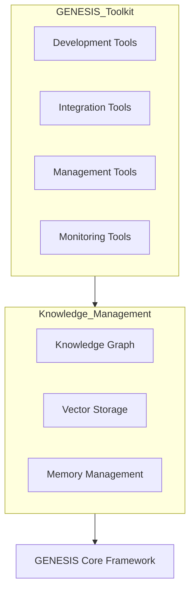
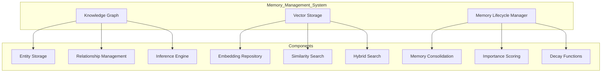
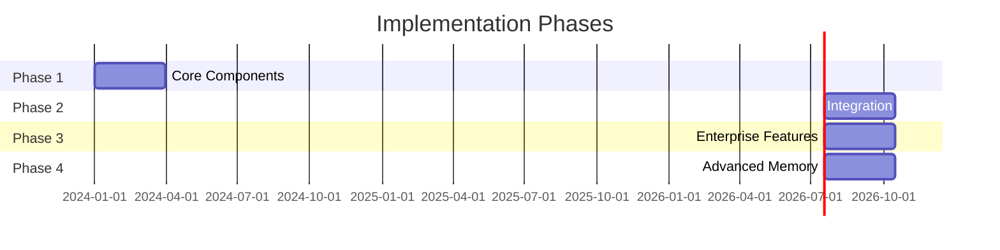
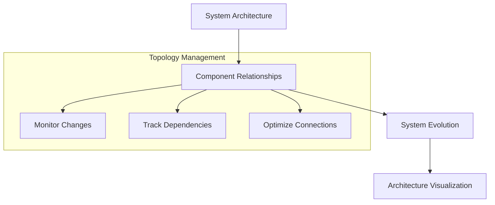

# GENESIS Toolkit Design Document

## Table of Contents
1. [Overview](#1-overview)
2. [Architecture](#2-architecture)
3. [Component Descriptions](#3-component-descriptions)
4. [Memory Management System](#4-memory-management-system)
5. [Implementation Strategy](#5-implementation-strategy)
6. [Tool Interoperability](#6-tool-interoperability)
7. [Knowledge Graph Use Cases](#7-knowledge-graph-use-cases)
8. [Conclusion](#8-conclusion)

## 1. Overview

The GENESIS Toolkit is a comprehensive suite of tools designed to simplify the development, integration, management, and monitoring of GENESIS agents and services. The toolkit addresses key challenges in large-scale distributed AI agent systems by providing standardized interfaces, automated workflows, and robust management capabilities.

## 2. Architecture



### Component Overview

| Component Type | Tools |
|---------------|-------|
| Development Tools | Templates, CLI, Testing Framework, Debugger |
| Integration Tools | Service Connectors, Adapters, Schema Generator |
| Management Tools | Agent Controller, Security Manager, Deployment Manager |
| Monitoring Tools | System Dashboard, Event Explorer, Performance Analyzer |

## 3. Component Descriptions

### 3.1 Development Tools

#### 3.1.1 Template Generator
- **Purpose**: Scaffolding for new agents and services
- **Features**:
  - Customizable templates for agents, services, interfaces
  - Automatic schema generation
  - Configuration generation

#### 3.1.2 GENESIS CLI
- **Purpose**: Command-line interface for rapid development
- **Features**:
  - Project initialization
  - Agent/service creation
  - Local testing
  - Deployment commands

#### 3.1.3 Testing Framework
- **Purpose**: Comprehensive testing for agents and services
- **Features**:
  - Mock DDS infrastructure
  - Service simulation
  - Test case generation
  - Automated validation

### 3.2 Integration Tools

#### 3.2.1 Service Connectors
- **Purpose**: Connect external services to GENESIS
- **Features**:
  - REST API integration
  - gRPC service wrapping
  - Legacy system adapters
  - Event-driven adapters

## 4. Memory Management System

### 4.1 Memory Architecture Overview



### 4.2 Knowledge Graph System

#### 4.2.1 Entity Management
- **Purpose**: Store and manage entities within the GENESIS ecosystem
- **Features**:
  - Type-aware entity storage
  - Schema-based validation
  - Versioning and history tracking
  - Property-based querying

#### 4.2.2 Relationship Management
- **Purpose**: Define and utilize relationships between entities
- **Features**:
  - Typed relationships
  - Bidirectional relationship tracking
  - Relationship attributes
  - Temporal relationship tracking
  - Relationship inference

### 4.3 Vector Storage System

#### 4.3.1 Embedding Repository
- **Purpose**: Store and manage vector embeddings
- **Features**:
  - Multi-model embedding support
  - Batch embedding generation
  - Embedding versioning
  - Metadata association

#### 4.3.2 Similarity Search
- **Purpose**: Find related entities based on semantic similarity
- **Features**:
  - Approximate nearest neighbor search
  - Exact k-NN search
  - Distance metric configuration
  - Hybrid filtering

### 4.4 Memory Lifecycle Management

#### 4.4.1 Memory Consolidation
```python
# Example: Knowledge graph-based memory retrieval
async def retrieve_relevant_context(self, query, limit=10):
    # Vector similarity search for semantic matching
    vector_results = await self.vector_store.similarity_search(
        query=query,
        limit=limit
    )
    
    # Knowledge graph traversal for related concepts
    entities = [result.metadata['entity_id'] for result in vector_results]
    graph_results = await self.knowledge_graph.find_related_entities(
        entities=entities,
        relationship_types=["AGENT_INTERACTION", "HAS_CAPABILITY"],
        max_distance=2
    )
    
    return combined_results[:limit]
```

### 4.5 Traditional vs. Knowledge Graph Memory Comparison

| Feature | Traditional List-Based Memory | Knowledge Graph Memory |
|---------|--------------------------------|------------------------|
| Structure | Linear, temporal storage | Multi-dimensional, relational |
| Relationships | Implicit, requires parsing | Explicit, queryable |
| Querying | Sequential search, indexing | Pattern matching, path traversal |
| Inference | Limited, algorithm-dependent | Native through relationship analysis |
| Scalability | Limited by RAM, eventual I/O | Distributed, optimized for relationships |
| Context Awareness | Manual context management | Natural through graph connections |
| Knowledge Evolution | Requires explicit updates | Can evolve through inference |
| Memory Efficiency | Redundant storage common | Normalized, reduced redundancy |
| Integration | Isolated memory per agent | Shared memory across system |

## 5. Implementation Strategy

### 5.1 Implementation Phases



### 5.2 Phase Details

#### Phase 1: Core Toolkit Components
- Development templates and CLI
- Basic monitoring dashboard
- Agent controller foundation
- Initial security framework
- Memory Management: Knowledge graph foundation

#### Phase 2: Integration and Testing
- Service connector framework
- Enhanced testing capabilities
- Expanded monitoring tools
- Advanced security features
- Memory Management: Vector storage integration

#### Phase 3: Enterprise Features
- Large-scale management tools
- Advanced security controls
- Performance optimization
- High availability features
- Memory Management: Distributed coordination

## 6. Tool Interoperability

### 6.1 Common Data Model
- Unified entity representation
- Consistent event structure
- Standardized metadata
- Version-compatible schemas
- Graph-compatible data modeling

### 6.2 Memory Access Interfaces
- GraphQL for knowledge graph queries
- Vector similarity API
- Memory lifecycle management API
- Context tracking interface

## 7. Knowledge Graph Use Cases

### 7.1 Agent Capability Discovery
- Map agent capabilities as graph entities
- Create relationships between capabilities and agents
- Enable discovery through graph traversal
- Generate capability chains via path finding

### 7.2 Agent Collaboration History
- Track agent interactions in the graph
- Record collaboration success/failure
- Build trust networks
- Optimize future collaboration based on history

### 7.3 Dynamic System Topology


## 8. Conclusion

The GENESIS Toolkit provides a comprehensive suite of tools to address the challenges of developing, integrating, managing, and monitoring complex distributed agent systems. By replacing traditional list-based memory with a sophisticated knowledge graph and vector storage system, the toolkit enables more powerful reasoning capabilities, improved context awareness, and efficient memory management at scale. This modern approach significantly enhances GENESIS agents' ability to maintain and leverage complex knowledge structures while supporting large-scale distributed deployments.