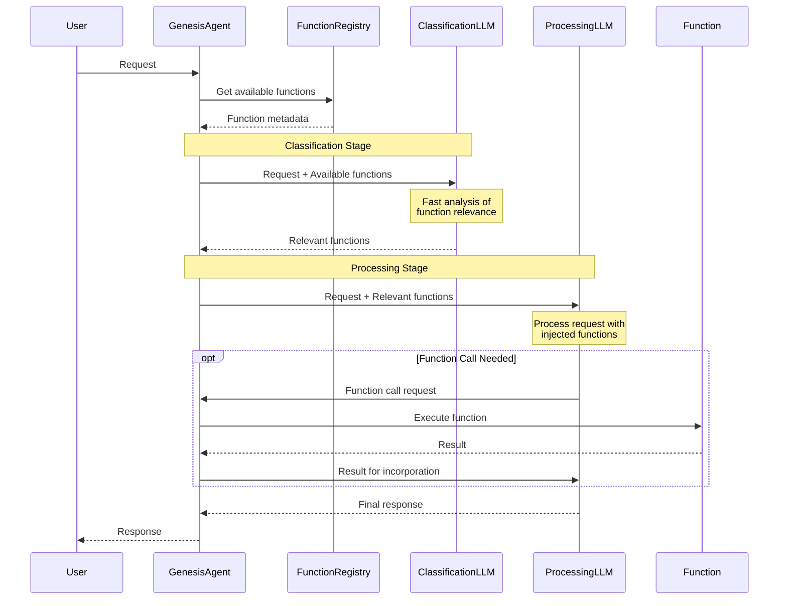

# Agent Function Injection System

## Overview
This document outlines the implementation of function injection in GENESIS agents. Function injection enables agents to dynamically incorporate available GENESIS functions into their LLM processing through an efficient two-stage approach:
1. Fast Classification Stage: Lightweight LLM quickly identifies relevant functions
2. Processing Stage: Full-featured LLM handles request with injected relevant functions

## Library Dependencies and Changes

### Existing Library Components Used
1. **GenesisAgent Base Class**
   - `function_registry`: Already provides function discovery and metadata storage
   - `process_request`: Base method we'll override in our implementation
   - No modifications needed to base class

2. **FunctionRegistry**
   - `discovered_functions`: Already provides access to available functions
   - `handle_capability_advertisement`: Already handles function registration
   - No modifications needed to registry

3. **AnthropicChatAgent**
   - Already provides Claude integration for both lightweight and full LLM capabilities
   - Supports different model selection (e.g., Claude Instant vs Claude)
   - No modifications needed to this class

### Testing Components (Not Part of Library)
1. **Test Implementation**
   - Will use base GenesisAgent directly
   - No specialized agent classes needed
   - Tests will verify both classification and processing stages
   - Example test case will use calculator functions but agent will have no hard-coded knowledge of them

2. **Function Injection Testing**
   ```python
   # Example test setup
   def test_dynamic_function_injection():
       # Create basic agent with no special knowledge
       agent = GenesisAgent()
       
       # Configure LLMs with appropriate models
       agent.classification_llm = AnthropicChatAgent(model="claude-instant")
       agent.processing_llm = AnthropicChatAgent(model="claude-3")
       
       # Start calculator function provider in background
       calculator = start_calculator_provider()
       
       # Wait for function discovery
       wait_for_discovery()
       
       # Test that agent can handle math query without prior knowledge
       response = agent.process_request("What is 5 times 3?")
       assert "15" in response['message']
   ```

### No Required Library Changes
The current library provides all necessary hooks and infrastructure:
- DDS communication ✓
- Function discovery ✓
- Metadata storage ✓
- LLM integration ✓
- Agent base classes ✓

## System Flow


## Components

### 1. Classification Stage
- Use lightweight LLM for fast function relevance analysis
- Format function metadata for efficient classification
- Quick filtering of available functions
- Optimized for speed and cost

### 2. Processing Stage
- Use full-featured LLM for reliable function execution
- Inject only relevant functions into prompt
- Handle complex reasoning and function composition
- Reliable function call formatting

### 3. Function Execution
- Parse LLM function call requests
- Execute requested functions
- Return results for incorporation

## Implementation Steps

1. **Enhance GenesisAgent**
   ```python
   class GenesisAgent:
       def __init__(self):
           super().__init__()
           # Set up LLMs with appropriate models
           self.classification_llm = AnthropicChatAgent(model="claude-instant")
           self.processing_llm = AnthropicChatAgent(model="claude-3")
           
       def process_request(self, request: str) -> Dict:
           # 1. Get available functions
           available_functions = self.function_registry.discovered_functions
           
           # 2. Classification Stage
           formatted_for_classification = self._format_for_classification(available_functions)
           relevant_functions = self.classification_llm.classify(
               request, formatted_for_classification
           )
           
           # 3. Processing Stage
           formatted_for_processing = self._format_for_processing(relevant_functions)
           prompt = self._build_prompt(request, formatted_for_processing)
           response = self.processing_llm.process(prompt)
           
           # 4. Handle any function calls
           if self._contains_function_calls(response):
               result = self._handle_function_calls(response)
               final_response = self.processing_llm.incorporate_result(result)
               return self._format_response(final_response)
           
           return response
   ```

## Testing Strategy

1. **Unit Tests**
   - Classification accuracy
   - Function metadata formatting
   - Prompt construction for both stages
   - Function call parsing

2. **Integration Tests**
   - End-to-end request processing
   - Classification performance
   - Processing accuracy
   - Function execution
   - Error handling

3. **Test Cases**
   - Simple queries requiring one function
   - Complex queries requiring multiple functions
   - Queries with no required functions
   - Error cases and recovery

## Success Criteria

1. **Functional Requirements**
   - Fast and accurate function classification
   - Reliable function execution
   - Proper result incorporation
   - Graceful error handling

2. **Performance Requirements**
   - Classification under 500ms
   - Function injection under 100ms
   - End-to-end processing under 3 seconds

3. **Quality Requirements**
   - Clear error messages
   - Graceful handling of unavailable functions
   - Proper function call validation
   - Cost-effective use of LLMs

## Next Steps

1. Implement classification stage with lightweight LLM
2. Implement processing stage with full LLM
3. Optimize function formatting for both stages
4. Write comprehensive test suite
5. Test and refine 