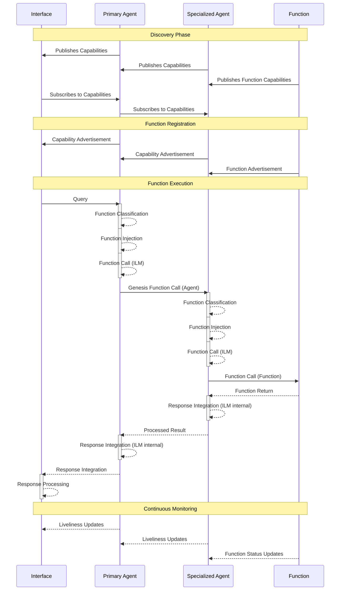

# GENESIS Function Call Flow

This document describes the flow of function calls in the GENESIS distributed system.



## Flow Description

1. **Discovery Phase**
   - Agents and Functions publish their capabilities through DDS
   - Interface subscribes to capability advertisements
   - Functions are discovered and registered in the function registry

2. **Function Registration**
   - Functions and Agents register their capabilities through DDS
   - Capabilities are advertised up the chain to make them available to other components
   - Registry maintains function and agent metadata and status

3. **Function Execution**
   - Interface sends query through DDS to Primary Agent
   - For each agent in the chain:
     - Agent performs internal function classification
     - Agent performs function injection
     - Agent makes function call decision:
       - Either calls another agent via DDS ("Genesis Function Call")
       - Or calls a function directly via DDS ("Function Call")
   - Results flow back through the chain:
     - Each agent performs internal response integration
     - Processed results are passed via DDS to the previous agent
   - Final response is delivered to the interface

4. **Continuous Monitoring**
   - Components monitor liveliness through DDS
   - Status updates flow up the chain via DDS
   - Interface maintains current availability state

## Agent Chaining Patterns

The GENESIS system supports natural agent chaining patterns where queries can flow through multiple specialized agents before reaching a function. Each agent in the chain can:
- Discover and invoke other agents or functions through DDS
- Transform or enhance requests and responses
- Add specialized processing or domain knowledge

### Common Chain Patterns

1. **Direct Function Access**
```
Interface <-> Primary Agent <-> Function
```
Used for simple function invocation where no specialized processing is needed.

2. **Single Specialization**
```
Interface <-> Primary Agent <-> Specialized Agent <-> Function
```
Used when domain-specific knowledge or processing is required.

3. **Multi-Specialization**
```
Interface <-> Primary Agent <-> Specialized Agent A <-> Specialized Agent B <-> Function
```
Used for complex workflows requiring multiple domains of expertise.

### Chain Discovery

- Each agent publishes its capabilities through the Function Registry
- Agents can discover both functions and other agents through the same mechanism
- The Function Classification System applies to both functions and agents
- Provider IDs in function_id field distinguish between agents and direct functions

### Chain Formation

Agents can form chains dynamically based on:
- Query requirements
- Available specialized agents
- Function requirements
- Performance considerations
- Security constraints

## Implementation Details

The flow is implemented through several key components:

- `GenesisApp`: Base class providing DDS infrastructure
- `FunctionRegistry`: Handles function registration and discovery
- `FunctionClassifier`: Classifies functions based on capabilities
- `FunctionMatcher`: Matches function requests to available functions

For more details, see the implementation in:
- `genesis_lib/genesis_app.py`
- `genesis_lib/function_classification.py`
- `test_functions/` directory for example functions 